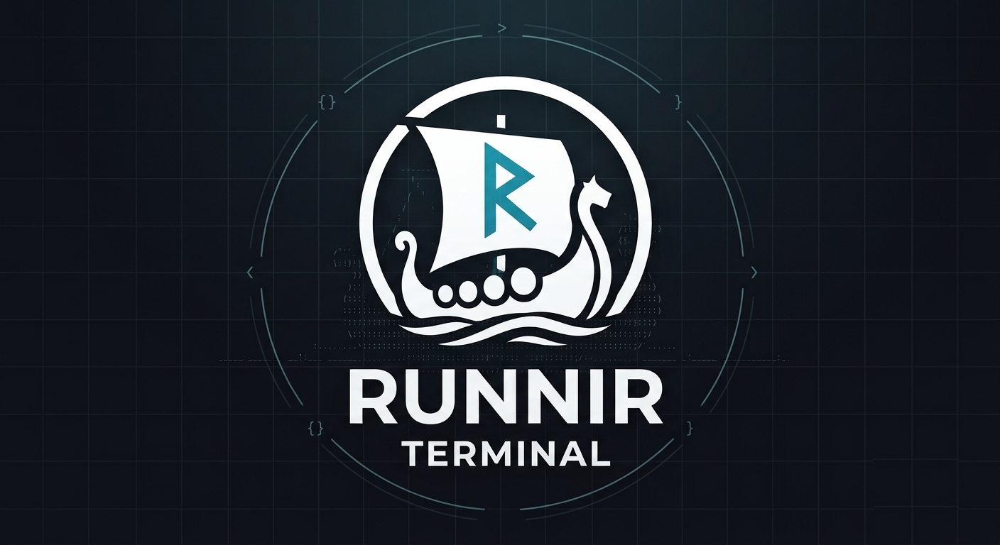

<p align="center">
  
</p>

# runnir

A GPU-accelerated terminal emulator, written from scratch in Rust.

The name is coined from Old Norse **rún** — which meant *secret, whisper, counsel spoken low* long before it meant *carved letter* — and the suffix **-nir** of Mjölnir, Gungnir and Sleipnir. The rune-artifact. A terminal is where you whisper to the machine.

## Status

Working: window, PTY, VT parser, GPU renderer, keyboard, scrollback, selection, fonts.
`vim`, `htop` and `btop` run inside it correctly.

| Milestone | |
|---|---|
| M0 — window + wgpu | done |
| M1 — PTY + VT parser → grid | done |
| M2 — glyph atlas + renderer | done |
| M3 — keyboard, alternate screen, scroll region | done |
| M4 — scrollback, selection, damage tracking | done |
| M5 — fonts: bold/italic, CJK, colour emoji, wide chars, ligatures, box drawing | done |
| M6 — layout tree (tabs + splits), keybindings, command palette | next |
| M7 — sessions, AI integration, SSH awareness | planned |

## Build

```sh
cargo run
```

Needs a Vulkan/Metal/DX12-capable GPU and a monospace font. `JetBrainsMono Nerd Font Mono`
is the default; override with `RUNNIR_FONT`.

## Design notes

**One draw call.** The whole screen is drawn as one instanced quad — one instance per
cell, carrying its glyph, colours and attributes. The fragment shader places the glyph
inside the cell and samples a single atlas.

**The renderer draws into a rect, not "the window".** Panes are just different rects into
the same surface, so splits cost almost nothing to add.

**Box-drawing characters are drawn, not rasterized from the font.** A font's strokes are
sized for the font's metrics, not the terminal's cell, so they leave gaps exactly where a
box needs to join. Drawing them at cell size makes every join seamless. kitty and Ghostty
do the same, for the same reason.

**Ligatures work the way monospace faces actually implement them:** the leading characters
map to *blank* glyphs and the last one to the full ligature carrying a large negative left
bearing, so it reaches back over them and the advance grid stays intact. Detecting them
means looking for blank glyphs followed by a real one — not for a cluster covering several
characters, which never happens.

**Nothing enters the scrollback except full-screen scrolls of the primary screen.** A
region scroll or anything on the alternate screen is not history; a minute of `htop` would
otherwise evict everything worth keeping.

**Idle costs nothing.** `ControlFlow::Wait`, plus a cached instance buffer rebuilt only
when the grid actually changes.

## Verification

Two headless modes, deliberately separate so a parser bug can never masquerade as a GPU bug:

```sh
runnir --dump   '<cmd>'                  # run cmd on a real PTY, print the grid as text
runnir --render out.png '<cmd>' [ms]     # render the grid to a PNG, no window involved
```

The delay matters for full-screen apps: without it the capture waits for the child to
exit, by which point it has already left the alternate screen.

```sh
cargo test
```

## Licence

MIT
