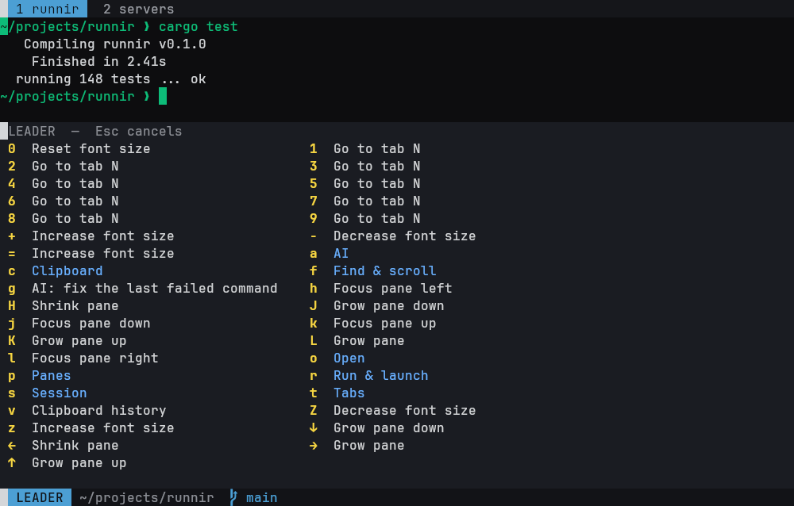
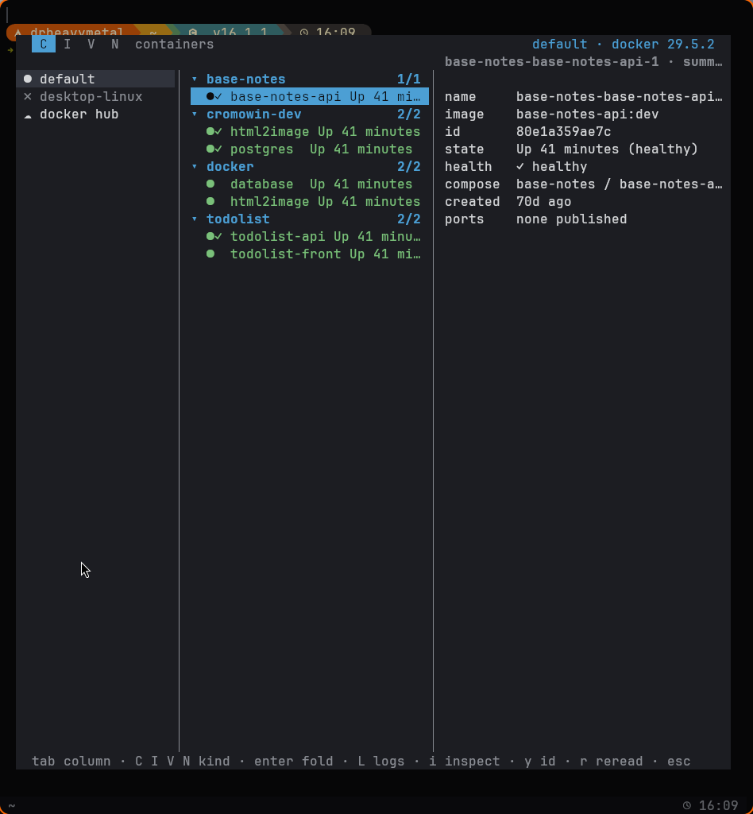
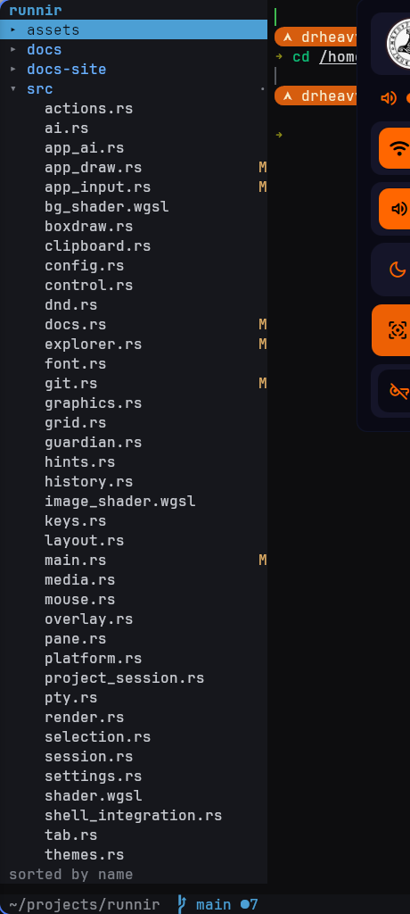
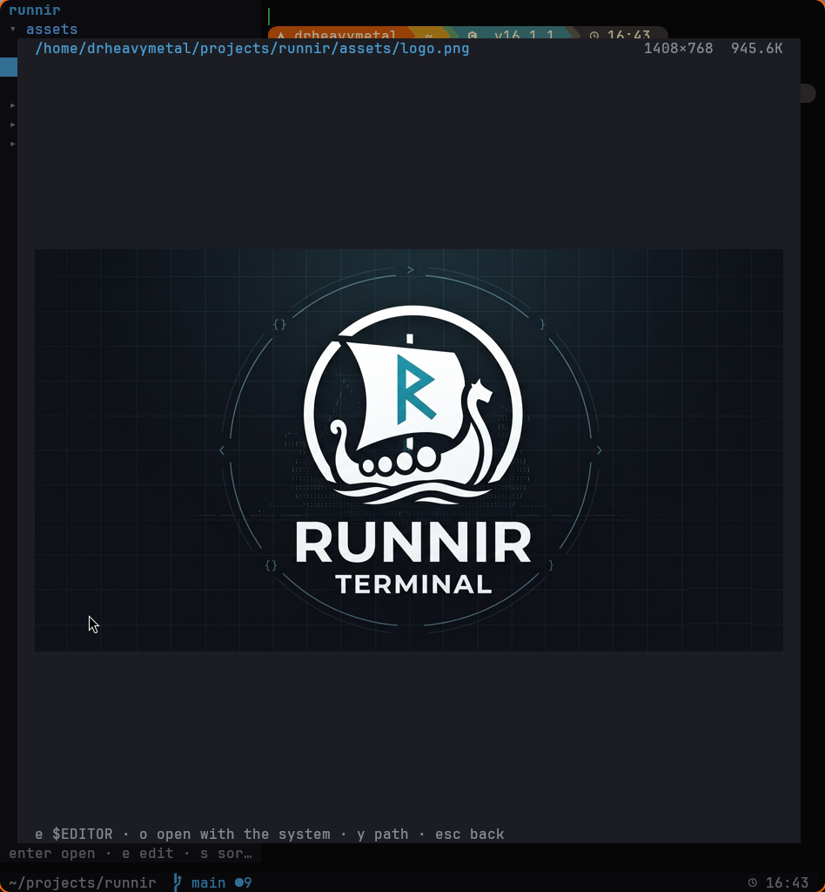
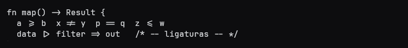
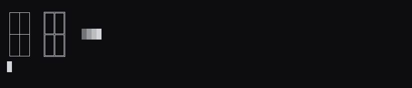

<p align="center">
  
</p>

<p align="center">
  <b>A GPU terminal that swallowed the tools you keep opening next to it.</b>
</p>

<p align="center">
  Written from scratch in Rust — wgpu + winit, own VT parser, own renderer, no terminal library underneath.
</p>

---

Most terminals are a fast rectangle you run other people's TUIs inside. runnir bets the
other way: when the renderer is yours, the git client, the file tree, the container
dashboard and the image viewer can be **native panels** instead of processes fighting for
the same 80×24. They share the theme, the keymap and the which-key layer, they draw at GPU
speed, and they know things a TUI cannot — which pane is sitting at a prompt, which file
the cursor is on, which host you are ssh'd into.

```sh
curl -fsSL https://raw.githubusercontent.com/drheavymetal/Runnir/main/install.sh | sh
```

No sudo, no package manager, nothing system-wide. It builds from source into `~/.local`,
drops a `.desktop` entry so your launcher finds it, and leaves `runnir-update` and
`runnir-uninstall` next to the binary. [Details below.](#install)

## What makes it different

### A leader layer that teaches itself

<p align="center">
  
</p>

Compositors win every modifier race — Hyprland and GNOME claim most of the Super layer,
and a key they grab never reaches an application at all. So runnir keeps its own layer
behind a leader key. Press `Alt+Shift+Space` and let go: a which-key panel lists what the
next key does, so you never memorise a table. The hot keys act at once (`1..9` tabs,
`hjkl` focus); the rest open a group. Every panel below has its own leader, filtered by
what the row under the cursor can actually do.

On a programmable keyboard you can leave the modifier race entirely: `F13`–`F24` are real
keycodes no desktop claims. Flash one onto a key, set `leader = "f13"`, done.

### A native git client, not lazygit in a pane

Status, log with a real graph, branches, stashes, blame, staging by individual lines, and
an interactive rebase you plan inside the panel. It understands worktrees and submodules,
and the tab bar carries a dirty marker per repository.

### A native Docker panel

<p align="center">
  
</p>

Containers, images, volumes, networks, health, logs, `exec` into a shell — plus Docker
Hub: which of your running tags have drifted from the registry, and a deploy that pulls
and brings the stack back up. Remote hosts over ssh, with confirmations that name the
host.

### A file explorer that is chrome, not a modal

<p align="center">
  
</p>

A persistent tree beside the panes, with git badges per row, a viewer for text and real
images, properties and permissions you can edit, and the operations that can lose work
asking first. It stays visible while you work in the pane next to it.

### Images that are actually images

<p align="center">
  
</p>

The kitty graphics protocol with real GPU textures, plus half-block art as a fallback.
Drop a file on the window and its path lands at the prompt; point a watch at a directory
and new images preview themselves.

### Rendering that sweats the details

<p align="center">
  
  
</p>

Programming ligatures, box-drawing glyphs drawn at cell size so every join is seamless,
styled underlines (curly, dotted, dashed, double, coloured), CJK and colour emoji, an
optional cursor trail, background images, and a scrollback minimap that draws coloured
text runs rather than bars.

### It can be driven from outside

```sh
runnir @ action --id git_panel      # run any action by its config id
runnir @ key --chord enter          # press a key, down the same path a real one takes
runnir @ click --col 30 --row 6     # click a cell
runnir @ wheel --col 4 --row 10     # turn the wheel there
```

`send-text` talks to the child process; these talk to **runnir itself**, so they reach the
overlays and the leader layer. Every reply carries the UI state as JSON, which is how the
panels are tested — no screenshots required.

### Your keyboard, if it is a ZSA

On a Moonlander or Voyager, runnir drives the lights through Keymapp's local API: the
leader layer lit on the keys themselves, and whole-board colour when a watched word
appears, a long command finishes, or the guardian asks whether you meant to run that.
Both off by default. [More below.](#the-zsa-keyboard)

### And the small things that add up

Shell integration over OSC 133/7 (jump between commands, a status gutter, a sticky prompt,
splits that inherit the cwd), copy mode, clipboard history, mouse-free hints on paths and
URLs and hashes, broadcast input to a group of panes, per-project sessions, saved layouts,
snippets, a command palette, a theme picker with live preview, a now-playing overlay with
album art, an AI panel that explains a failure or writes the command you describe, and a
guardian that stops `rm -rf /` before Enter reaches the shell.

## Install

```sh
curl -fsSL https://raw.githubusercontent.com/drheavymetal/Runnir/main/install.sh | sh
```

(`wget -qO- https://raw.githubusercontent.com/drheavymetal/Runnir/main/install.sh | sh`
works too.)

It clones into `~/.local/share/runnir/src`, runs `cargo build --release`, installs the
binary to `~/.local/bin/runnir`, and drops two helpers beside it. On Linux it also
installs a `.desktop` entry and icon; on macOS that step is skipped.

```sh
runnir-update      # fetch, rebuild, reinstall — keeps your config
runnir-uninstall   # remove binary, helpers, desktop entry — keeps config and source
```

**Requirements.** `git`, and a Rust toolchain, since runnir builds from source. If `cargo`
is missing the installer points you at [rustup](https://rustup.rs) and, run interactively,
offers to install it — never silently; piped installs stop with instructions rather than
installing a toolchain without consent. Plus a Vulkan/Metal/DX12 GPU and a monospace font
(`JetBrainsMono Nerd Font Mono` by default, override with `RUNNIR_FONT`).

**Overrides.** `PREFIX` sets the install prefix (default `$HOME/.local`); the binary lands
in `$PREFIX/bin/runnir`. `PREFIX=/usr/local sh install.sh` is the one case where running as
root is allowed. If `~/.local/bin` is not on your `PATH`, the installer tells you how to
add it.

The same [`install.sh`](install.sh) drives all three flows, so `sh install.sh --help` from
a checkout shows every option.

## The AI assistant — bring your own provider

No provider is baked in. Three shapes are supported:

- **`kind = "claude_code"`** — spawns the Claude Code CLI against your subscription.
  No API key at all.
- **`kind = "api"`** — any OpenAI-compatible `/chat/completions` endpoint: OpenAI,
  Gemini, DeepSeek, Z.ai, a local llama.cpp server, whatever. Point `base_url` at it
  and name the model.
- **`kind = "anthropic"`** — Anthropic's own Messages API, which is *not*
  OpenAI-compatible: different path, `x-api-key` instead of a bearer token, a pinned
  version header, and a required `max_tokens`. Its own kind rather than an `api`
  entry that would look right and fail at request time.

```toml
[ai]
default = "claude-api"

[ai.providers.claude-api]
kind = "anthropic"
model = "claude-opus-4-8"
api_key_env = "ANTHROPIC_API_KEY"   # the KEY NAME, never the key

[ai.providers.local]
kind = "api"
base_url = "http://localhost:8080/v1"
model = "qwen2.5-coder"
api_key_env = "LOCAL_KEY"
```

Keys are never stored in the config — each provider names an environment variable, so
the file is safe in a dotfile repo. Switch provider without editing anything:
`Ctrl+Shift+,` and the AI row cycles through everything you have configured, showing
which model is behind each name.

**Per-task routing**, because the economics differ per task — summarising a whole
session is long and cheap on a flat-rate subscription, while translating one sentence
into a command wants the lowest latency you can get:

```toml
[ai]
default = "claude"          # the CLI, on your subscription

[ai.tasks]
command = "claude-api"      # one sentence in, one command out: latency matters
whisper = "claude-api"
                            # panel, fix, explain and summarize keep the default
```

The six task names are `panel`, `command`, `fix`, `explain`, `summarize` and
`whisper`. A misspelled task, or one pointing at a provider that does not exist, is
reported when the config loads — a wrong name has no symptom at request time, it just
quietly uses the default for ever.

## Configuration

`~/.config/runnir/runnir.toml` — every value has a default that stands on its own, so an
absent or partial file is normal. A malformed file is reported and then ignored: a typo in
a colour must never cost you your terminal. There is also a settings panel inside the
terminal (`Ctrl+Shift+,`) that writes JSON; both hot-reload.

Press `F1` inside runnir for the full manual. It lives in the binary, so it can never fall
out of step with the build you are running.

## The ZSA keyboard

On a ZSA board (Moonlander, Voyager), runnir can drive the lights through
[Keymapp](https://www.zsa.io/flash)'s local API — no custom firmware, and nothing at all
unless you ask for it.

- **`keyboard.leader_lights`** lights the leader layer ON THE KEYS: arming lights exactly
  the keys that do something at that level, in the which-key panel's own colours, and
  descending into a group repaints. Leaving the layer gives the board its colours back.
- **`keyboard.ambient`** flashes the whole board where a desktop notification already
  fires: amber for a watched word, green when a long command finishes, red when the
  guardian asks.

Both are off by default and need Keymapp running with its API enabled (it ships disabled)
plus `cargo install kontroll`. With Keymapp absent the feature simply does not exist — no
error at startup, none per keystroke. `RUNNIR_ZSA_DEBUG=1` says which step gave up.

**The lit layer needs shine-through keycaps to be worth having.** With opaque caps the LED
lights the gap around the cap rather than the legend, so what reaches the eye is a glow in
a region and not a key you can name — measured on a Moonlander with 33 keys lit, with 8,
and with those 8 in white at maximum brightness. The ambient flashes do not have that
problem: they ask you to identify no key at all.

## Design notes

**One draw call.** The whole screen is one instanced quad — one instance per cell, carrying
its glyph, colours and attributes. The fragment shader places the glyph inside the cell and
samples a single atlas.

**The renderer draws into a rect, not "the window".** Panes are different rects into the
same surface, so splits cost almost nothing to add.

**Box-drawing characters are drawn, not rasterized from the font.** A font's strokes are
sized for the font's metrics, not the terminal's cell, so they leave gaps exactly where a
box needs to join. Drawing them at cell size makes every join seamless. kitty and Ghostty
do the same, for the same reason.

**Ligatures work the way monospace faces actually implement them:** the leading characters
map to *blank* glyphs and the last one carries the full ligature with a large negative left
bearing, so it reaches back over them and the advance grid stays intact. Detecting them
means looking for blank glyphs followed by a real one — not for a cluster spanning several
characters, which never happens.

**Nothing enters the scrollback except full-screen scrolls of the primary screen.** A
region scroll, or anything on the alternate screen, is not history; a minute of `htop`
would otherwise evict everything worth keeping.

**Idle costs nothing.** `ControlFlow::Wait`, plus a cached instance buffer rebuilt only
when the grid actually changes.

## Status

A daily driver on Linux/Wayland (Hyprland). `vim`, `htop`, `btop` and full-screen TUIs
behave; 441 tests, no warnings. macOS builds and runs but gets far less use, and the
`/proc`-based niceties (pane cwd, foreground process detection) fall back to the shell's
own reports there. Windows is not supported.

Version numbers are not meaningful yet: `main` is what is used every day, and the DEVLOG
in `docs/DEVLOG.md` is the honest history — including the features that were measured and
then abandoned.

## Building and verifying

```sh
cargo run                                # debug
cargo build --release
cargo test
```

Two headless modes, deliberately separate so a parser bug can never masquerade as a GPU
bug:

```sh
runnir --dump '<cmd>'                    # run cmd on a real PTY, print the grid as text
runnir --render out.png '<cmd>' [ms]     # render the grid to a PNG, no window involved
runnir --demo out.png [scene]            # render a scene: a leader level, the git panel…
```

The delay matters for full-screen apps: without it the capture waits for the child to
exit, by which point it has already left the alternate screen.

## Licence

MIT.

The name is coined from Old Norse **rún** — *secret, whisper, counsel spoken low*, long
before it meant *carved letter* — and the **-nir** of Mjölnir, Gungnir and Sleipnir. The
rune-artifact. A terminal is where you whisper to the machine.
